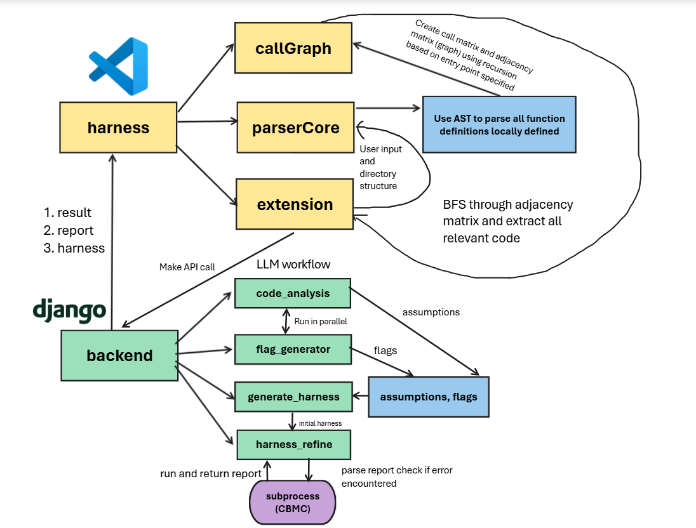

# CBMC Harness Generation and Checker
This system is a VScode extension for developers, allowing them to generate a memory safety verification report from running CBMC (C-bounded model checker) on a harness generated by LLMs. The user only has to open a directory within VScode's workspace folder, specify a function within the current active .c file on screen then run the extension to receive the complete report.

## **Table of Contents**

1. [Prerequisites](#prerequisites)
2. [Project Structure](#project-structure)
3. [Set Up Project](#setting-up-project)
4. [Quickstart](#quickstart)
6. [Additional Information](#additional-information)

## **Prerequisites**

Ensure you have the following installed on your system:

- `node` I have v20.6.1 on my environment
- `npm`I have version 9.8.1
- `python` You'll need pip
- `cbmc` Environmental variables have to be set up, has to be able to work from terminal

## **Project Structure**

The project consists of 3 main directories:

- `harness` (VS code extension Frontend)
- `backend` (Django Backend)
- `cbmc` (C code to run tests on)



## **Setting Up Project**
If you haven't already done so, clone the repository
### 1. Install all necessary packages for JS (frontend)
Navigate into the `harness` directory then run:
```bash
npm i
```
### 2. Test out VScode extension
Navigate over to the `extension.js` file and then open it so it is your current active file in VScode, then press `f5`. If you're asked to choose runtime, use `Extension Development`. Once you have the second (user) window opened, press `ctrl + shift + P` (or `Cmd + shift + P` on Mac) then type in:
```
helloworld
```
Pressing enter should show an information box indicating successful set up
### 3. Getting Django running and cloning the FreeRTOS repository (coreHTTP)
You'll need to clone the [FreeRTOS coreHTTP](https://github.com/FreeRTOS/coreHTTP) repo over in order to start generating complete reports with coverage.
First, navigate over to `backend` then run:
```
python3 -m venv venv
source venv/bin/activate  # (Windows: venv\Scripts\activate)
pip install -r requirements.txt
mkdir cbmc # create a folder called 'cbmc' here first
cd cbmc
git clone https://github.com/FreeRTOS/coreHTTP.git # then clone the coreHTTP repository
cd ..
cd extension_backend # Then navigate into extension_backend/
python manage.py runserver # this will start the Django server
```
Now send a `curl` request or any API GET request over to `http://localhost:8000` the response you receive should indicate that Django is up and running


## **Quickstart**
Make sure your backend server is running (`python manage.py runserver`) and activate extension through pressing `f5` with current active file in window being `extension.js`.
Open your VS code workspace so that it opens the `cbmc/coreHTTP` folder over at `backend`. Bring up the `core_http_client.c` file within `source` then `ctrl + shift + P`. Type `generate` within the dialogue box and then enter a function like `HTTPClient_AddHeader`. Once the .txt file is opened up in VScode you should be able to view the complete coverage `html` report at `~backend/cbmc/coreHTTP/test` where you would normally expect the report directory to be at.

*Note that the function name being entered has to be an exact case-sensitive match to a function within the current active C file on your screen

## **Additional Information**
You'll also need to put the `.env` file containing the keys into the same folder as `CBMC_LLM_Harness_Generation/backend`